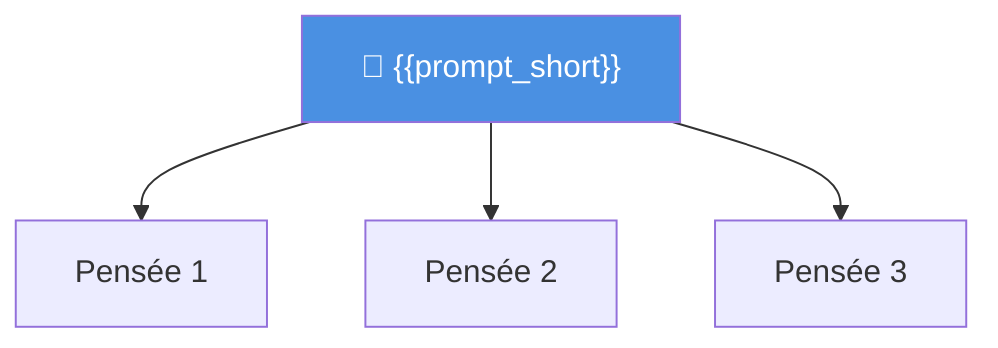

# Carte Neurale — {{session_id}}

> **Session** : `{{session_id}}` · **Algorithme** : {{algorithm}} · **Section** : {{section}}

## Graphe de raisonnement

> *Remplacez ce diagramme par le graphe Mermaid généré automatiquement lors d'une session réelle.*

---

## Prompt initial

> {{prompt}}

---

## Nœuds de la session

| Nœud | Score | Note |
|---|---|---|
| *(Rempli automatiquement)* | — | — |

---

## Index des notes

*(Liens générés automatiquement vers toutes les notes de cette session)*

---

## Navigation

- Index session : [[Index ToT - {{session_id}}]]

---

*Carte générée par Tree of Thoughts · {{date}}*
